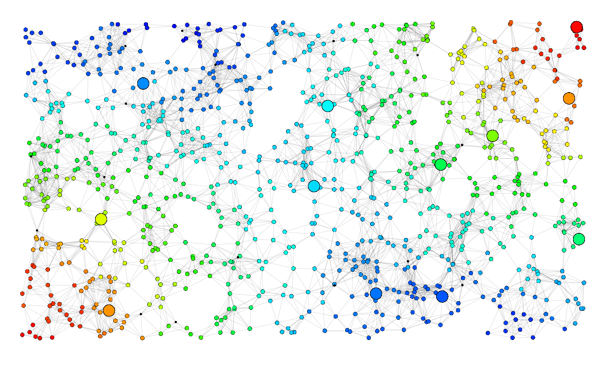

# Self-Organising Coordination Regions (SCR) Example

This simulation contains the example of the Self-Organising Coordination Regions described in the software-x paper.

Particularly, in this repository we simulate a scenario in which 
we are interested in temperature monitoring 
and control in a large environment.

To run the simulation, you can type:
```
sbt run
```

This produces the following result:




For more details about SCR we suggest to read the following work:

- [Self-organising Coordination Regions: A Pattern for
  Edge Computing](https://hal.inria.fr/hal-02365498/document)